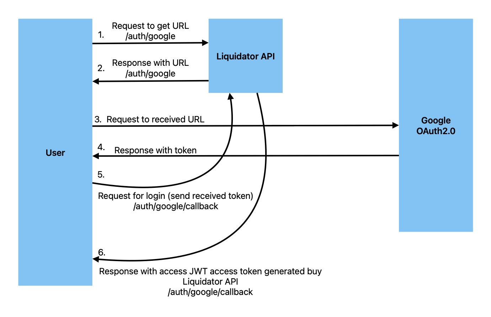

# Liquidator API

What does it means?

1. liquid - like a liquid
2. ator - authenticator

There are 3 endpoints:

1. **/auth/register** - register
2. **/auth/log-in** - log-in
3. **/user** - get user info

There are [Swagger](http://localhost:8000/swagger) documentation.

After you run tests you can find coverage results in this [file](./coverage/lcov-report/index.html)

## How to run it?

Install packages:

```sh
yarn install
```

Start dev docker:

```sh
yarn start:docker:dev
```

Run migrations in dev DB:

```sh
yarn db:dev:migrate
```

Run tests:

```sh
yarn start:dev
```

Then you can open [Swagger](http://localhost:8000/swagger)

## How to tests it?

Install packages if not installed yet

```sh
yarn install
```

Start test docker:

```sh
yarn start:docker:test
```

Run migrations in test DB:

```sh
yarn db:test:migrate
```

Run tests:

```sh
yarn test:e2e
```

**Test coverage results:**

```
--------------------------|---------|----------|---------|---------|-------------------
File                      | % Stmts | % Branch | % Funcs | % Lines | Uncovered Line #s
--------------------------|---------|----------|---------|---------|-------------------
All files                 |   95.96 |    93.75 |   97.05 |   95.33 |
 src                      |   73.33 |      100 |      50 |   71.42 |
  app.module.ts           |     100 |      100 |     100 |     100 |
  app.ts                  |     100 |      100 |     100 |     100 |
  drizzle.config.ts       |       0 |      100 |     100 |       0 | 1-5
  main.ts                 |       0 |      100 |       0 |       0 | 1-10
 src/auth                 |     100 |      100 |     100 |     100 |
  auth.controller.ts      |     100 |      100 |     100 |     100 |
  auth.module.ts          |     100 |      100 |     100 |     100 |
 src/auth/decorators      |   83.33 |        0 |     100 |   83.33 |
  get-user.decorator.ts   |   83.33 |        0 |     100 |   83.33 | 14
 src/auth/dto             |     100 |      100 |     100 |     100 |
  auth.dto.ts             |     100 |      100 |     100 |     100 |
 src/auth/guards          |     100 |      100 |     100 |     100 |
  auth-jwt.guard.ts       |     100 |      100 |     100 |     100 |
 src/auth/services        |     100 |      100 |     100 |     100 |
  auth.service.ts         |     100 |      100 |     100 |     100 |
  jwt-internal.service.ts |     100 |      100 |     100 |     100 |
 src/config               |     100 |      100 |     100 |     100 |
  index.ts                |     100 |      100 |     100 |     100 |
 src/db                   |     100 |      100 |     100 |     100 |
  schema.ts               |     100 |      100 |     100 |     100 |
 src/drizzle              |     100 |      100 |     100 |     100 |
  diozzle.service.ts      |     100 |      100 |     100 |     100 |
  drizzle.module.ts       |     100 |      100 |     100 |     100 |
 src/redis                |     100 |      100 |     100 |     100 |
  redis.module.ts         |     100 |      100 |     100 |     100 |
  redis.service.ts        |     100 |      100 |     100 |     100 |
 src/user                 |     100 |      100 |     100 |     100 |
  user.controller.ts      |     100 |      100 |     100 |     100 |
  user.module.ts          |     100 |      100 |     100 |     100 |
  user.service.ts         |     100 |      100 |     100 |     100 |
 src/user-cache           |     100 |      100 |     100 |     100 |
  user-cache.module.ts    |     100 |      100 |     100 |     100 |
  user-cache.service.ts   |     100 |      100 |     100 |     100 |
--------------------------|---------|----------|---------|---------|-------------------
```

## Social login concept

Diagram:



I would use standard flow:
1. user get URL
2. user to to the URL
3. user receive response with token
4. user send the token to our API
5. our API generate access JWT token end send it to a user
